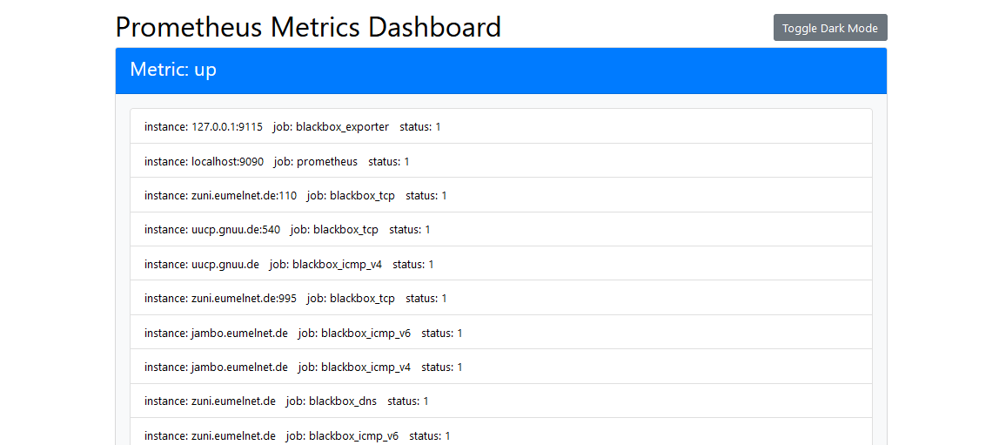

# prometheus-dashboard

A simple web server to serve and show some Prometheus metrics and Alertmanager alerts



This tool is for people who has running Prometheus and Alertmanager in the backend and want to show some few metrics on the web without heavy tools like Grafana. Use case is a kind of status page or status view on mobile app-

# precondition

- Prometheus running on http://127.0.0.1:9090
- Alertmanager running on http://127.0.0.1:9093
- adjust the metrics in the index.html template

# usage

```
-/prometheus-dashboard
```

The dashboard will serve on 0.0.0.0:8080 and can be visit by http://<your-install-server>:8080
